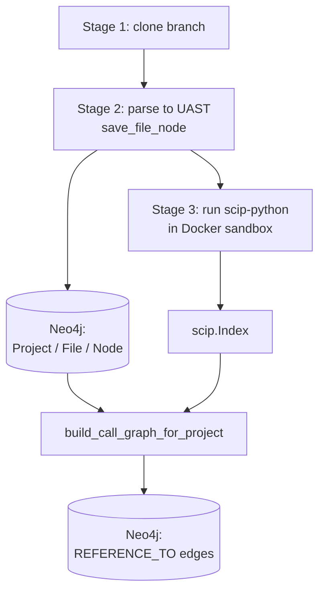
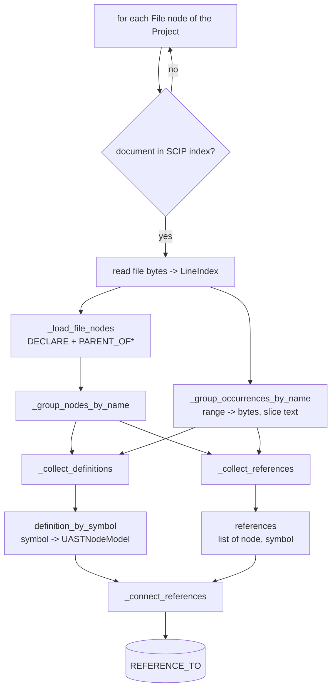
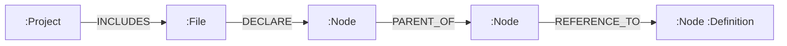

# Call graph building

> [!NOTE]
> See [build.py](../app/graph/build.py), [model.py](../app/graph/model.py),
> [index_reader.py](../app/scip/index_reader.py), [position.py](../app/scip/position.py)

Tree-sitter only knows *syntax*: it sees `g.greet()` but cannot tell which `greet` that is.
SCIP supplies the missing name resolution. Building the call graph is therefore a **join
between two data sources that describe the same file in different coordinate systems**.

The entry point is:

```python
build_call_graph_for_project(project_id: int, index: scip.Index, project_root: Path) -> None
```

## Where it runs in the pipeline



Both inputs must already exist:

- **Neo4j** holds the UAST of every file, written by
  [save_node.py](../app/graph/save_node.py).
- **`scip.Index`** is produced by `SCIPSandbox.index()`
  ([sandbox.py](../app/scip/sandbox.py)) and parsed with `Index.ParseFromString`.
- **`project_root`** is the directory the SCIP document paths are relative to — the same
  `local_path / root_dir` that stage 2 walked. It is required because the coordinate
  conversion needs the raw file bytes.

## The two mismatches this has to solve

### 1. Ranges do not line up

A SCIP occurrence covers **only the identifier**. A UAST reference node covers the
**whole expression**, because its range comes from the tree-sitter node that carried the
capture (`UASTNodeBuilder.from_ts_node`); the position of `@meta.name` is discarded.

| Source | UAST node | SCIP occurrence |
|---|---|---|
| `build_message(self.name)` | `CallNode name='build_message'` bytes `(164,188)` | `(164,177)` |
| `g.greet()` | `CallNode name='greet'` bytes `(347,356)` | `(349,354)` |
| `g.greet` | `AttributeAccessNode name='greet'` bytes `(347,354)` | `(349,354)` |

So `node.start_byte == occurrence.start_byte` is **wrong**. For a dotted call the node
starts at the receiver (`g`), nowhere near the identifier the node is named after.
The join is **containment + name equality** instead.

### 2. Coordinates do not line up

SCIP addresses source as `(line, character)` and counts *characters*. Tree-sitter is fed
`bytes`, so its columns and `start_byte`/`end_byte` count *bytes*. The two agree only on
pure ASCII.

Every conversion goes through `LineIndex` ([position.py](../app/scip/position.py)).
Skipping it silently corrupts any line containing a non-ASCII character:

```
range=(9, 8, 12)   sym=Máy#chạy().
  via LineIndex  bytes=(125,131) -> 'chạy'
  naive          bytes=(125,129) -> 'ch�'      WRONG

range=(10, 27, 36) sym=tinh_tong().
  via LineIndex  bytes=(175,184) -> 'tinh_tong'
  naive          bytes=(173,182) -> ' {tinh_to'   WRONG
```

## Algorithm

Both sides are grouped **by identifier text**, which is the key the matching relies on.
The walk visits each file once and accumulates two things; edges are created only at the
end, because a reference may point at a definition in a file not yet read.



### Pass 1 — `_collect_definitions`

For every occurrence with `is_definition`, find the UAST node that declares it:

1. slice the source at the occurrence's byte span — that text **is** the identifier name;
2. among nodes carrying that name, keep those whose span **contains** the occurrence;
3. pick the **smallest** one, preferring `DefinitionNodeModel` subclasses.

Step 3 matters because a definition identifier sits inside every enclosing node — a
method's name is inside both its `TypeDefinition` node and its `Function` node. The
innermost match is the one that actually declares it.

The first definition of a symbol wins: conditional definitions and `@overload`
legitimately produce several sites.

### Pass 2 — `_collect_references`

For every node that is a `ReferenceNodeModel` (`Call`, `AttributeAccess`,
`TypeReference`), take the **first non-definition** occurrence that is contained in the
node's span and whose text equals `node.name`.

Definition occurrences are excluded on purpose. In `self.name = name` the
`AttributeAccessNode` **is** the definition site, so matching it would only produce a
self-loop.

### Pass 3 — `_connect_references`

Look the symbol up in `definition_by_symbol`:

- **found** → `node.references.connect(target)` creates `REFERENCE_TO`;
- **not found** → the symbol is defined outside the project (standard library,
  third-party). Counted as `external` and skipped — no node is created for it;
- **target is the node itself** → skipped.

## Worked example

Source (`sample.py`, line 19):

```python
    print(g.greet())
```

UAST nodes and SCIP occurrences over the same bytes:

```
UAST                                    SCIP occurrences
CallNode        'print' (341,357)       print (341,346)  builtins/print().
CallNode        'greet' (347,356)       g     (347,348)  local 1
AttributeAccess 'greet' (347,354)       greet (349,354)  sample/Greeter#greet().
```

Three occurrences fall inside `CallNode 'print'`. Matching on the node's `name` is what
selects `print` rather than `g` or `greet`. Resolution:

| Reference node | Matched occurrence | Symbol | Result |
|---|---|---|---|
| `CallNode 'print'` | `print` | `builtins/print().` | external — skipped |
| `CallNode 'greet'` | `greet` | `Greeter#greet().` | → `FunctionNode 'greet'` |
| `AttributeAccess 'greet'` | `greet` | `Greeter#greet().` | → `FunctionNode 'greet'` |

Note that SCIP resolved the receiver `g` to `Greeter` on its own — that inference is
exactly what tree-sitter could not do.

## Resulting graph



`REFERENCE_TO` is declared on `UASTNodeModel` as `references` / `referenced_by`
([model.py](../app/graph/model.py)). Because neomodel applies every label in the class
hierarchy, a `CallNodeModel` is stored as `:Call:Reference:Node`, so `MATCH (n:Reference)`
matches all three reference kinds.

Useful queries:

```cypher
// who calls a given function
MATCH (caller:Reference)-[:REFERENCE_TO]->(:Function {name: 'build_message'})
MATCH (f:File)-[:DECLARE]->()-[:PARENT_OF*0..]->(caller)
RETURN f.relative_path, caller.name, caller.start_row;

// what a file depends on
MATCH (f:File {relative_path: 'app.py'})-[:DECLARE]->()-[:PARENT_OF*0..]->(s:Reference)
MATCH (s)-[:REFERENCE_TO]->(t)<-[:PARENT_OF*0..]-()<-[:DECLARE]-(tf:File)
RETURN DISTINCT tf.relative_path;

// sanity check: must be 0
MATCH (n)-[:REFERENCE_TO]->(n) RETURN count(n);
```

## Implementation notes

- `DECLARE` links a file only to its **top-level** nodes, so `_load_file_nodes` reaches
  the rest with `-[:DECLARE]->()-[:PARENT_OF*0..]->(n:Node)`.
- `ProjectNodeModel.uid` is a `StringProperty` while the pipeline passes an `int`.
  neomodel stores it as text, so raw Cypher must match on `str(project_id)`.
- Files present in Neo4j but absent from the index, and files no longer readable on disk,
  are skipped with a log line. A partial graph is more useful than a failed build.
- `local N` symbols are scoped to one document; `read_index` already qualifies them with
  their document path, so they cannot collide across files.

## Known limitations

- **Python (and JS/TS) only.** [java/query.scm](../app/parser/languages/java/query.scm)
  has no `@reference.*` captures, so Java files produce no reference nodes and no edges.
  Adding Java support is a query change, not a `build.py` change.
- **`Document.position_encoding` is not read.** `LineIndex` treats `character` as a code
  point, which is right for `scip-python`. `scip-typescript` uses UTF-16 and would drift
  on lines containing astral-plane characters (emoji).
- **Typed ranges are not read.** The vendored proto has
  `single_line_range`/`multi_line_range`, but current indexers still emit the older
  `range` field. An index using only the typed variant logs a warning and is skipped
  rather than crashing.
- **Re-indexing creates new nodes.** `UASTNode.id` is a random `uuid4`, so re-running the
  pipeline produces fresh nodes and leaves old edges attached to orphaned ones. This is a
  property of `save_node.py`, not of the call graph builder.
- **External symbols are not materialised.** Dependencies on the standard library and
  third-party packages are counted and dropped. `SymbolTable.external_symbols()` is
  available if they are ever needed.
