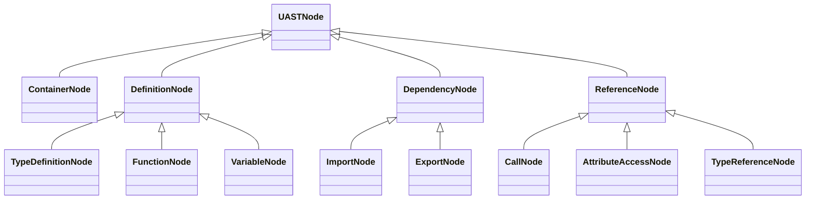

# Tree-sitter
> [!NOTE]
> See [types.py](../app/parser/uast/types.py)
# Language Config and Language Registry

# Convert CST to UAST
Use tree-sitter query to convert CST to UAST.

## Capture name list
Main capture name:
- `@container`
- `@definition`
- `@dependency`
- `@reference`
- `@meta`

### Capture: `@container`
- `@container.project`: Repository, not in tree-sitter query
- `@container.module`: Repo's module(directory, ...), not in tree-sitter query
- `@container.file`: file, root not of any tree convert from a file.

### Capture: `@definition`
### Type Definition Capture(Class-Like definition)
- `@definition.class`:  
- `@definition.interface`:
- `@definition.enum`:
- `@definition.struct`: c/cpp struct, java record, ...
- `@definition.protocol`: go/rust
- `@definition.trait`: go/rust

### Funtion/Callable Capture
- `@definition.function`: single function, not belong to any class
- `@definition.method`: function that belong to a class
- `@definition.lambda`: anonymous function/ callback function/...

### Variable definition
- `@definition.variable`: normal variable
- `@definition.constant`: constant
- `@definition.parameter`: function/method 's parameter

### Capture: `@dependency`
- `@dependency.import`
- `@dependency.export`

### Capture: `@reference`
- `@reference.call`
- `@reference.attribute`
- `@reference.type`

### Capture: `@meta`
- `@meta.name`: identifier. Example: class name, function name, variable name, ...
- `@meta.doc`: docstring
- `@meta.modifier`: public, private, protected, abstract, async, final, ....
- `@meta.visibility`: Edge case of modifier. Example: public/private/protected in Java
- `@meta.base_type`: base type of class - for inheritance
- `@meta.type`: data type. For funtion/method: return type. For variable: data type
- `@meta.value`: for variable: init value
- `@meta.enum_value`: for enum class only
- `@meta.decorator`: decorator(in python), annotation(in java) ...
- `@meta.module_path`: for `@dependency`
- `@meta.alias`: for `@dependency` - import/export alias
- `@meta.subject`: for `@reference.call`

## UAST inheritance design

## UASTNode

## ContainerNode

## DefinitionNode

## DependenceNode

## ReferenceNode

