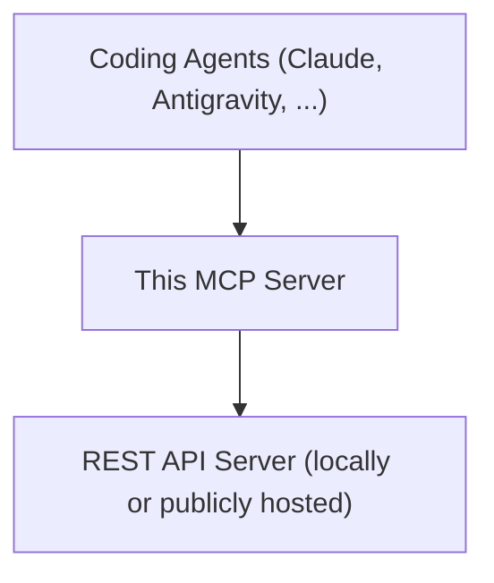

# Table of Contents
- [Introduction](#intro)
- [Requirements](#requirements)
- [Setup API Server](#setup-api-server)
- [Setup MCP Server](#setup-mcp-server)
- [Available CLI Commands](#available-cli-commands)
- [Available MCP Capabilities](#available-mcp-capabilities)
  - [Tools](#tools)
  - [Resources](#resources)
  - [Prompts](#prompts)

# Introduction <a name="intro"></a>
This MCP server runs on your local machine and communicates over the `stdio` (Standard Input/Output) transport - meaning
it talks to your coding agent through standard input/output streams rather than over the network.

The server is published to `PyPI`, so you can run it directly with the `uvx` command, without a
manual installation step.
- Package name: `source-context-mcp`
- For more details: https://pypi.org/project/source-context-mcp/

This MCP server does not analyze your source code by itself. It is a thin bridge:
 - It receives tool calls from your coding agent.
 - It forwards those calls, with your credentials, to a REST API server.
 - That API server is the one actually indexing and analyzing your codebase, and it returns the results back through
the MCP server to your agent.

So before using this MCP server, you need that REST API server up and running (locally or publicly hosted).



# Requirements <a name="requirements"></a>
- uv: a Python package manager, used to run this MCP locally via the `uvx` command (similar in spirit to `npx` for
Node.js packages).
- Python version: 3.12+
- A running REST API server with authentication enabled — see [Setup MCP Server](#setup-mcp-server) below for setup.

# Setup API Server <a name="setup-api-server"></a>
See: https://github.com/TuLe142857/source-context

This server manages your team workspace (a workspace can contain many repositories), handles indexing, analyzes the
codebase, and exposes the REST API that this MCP server calls. You can host it on your local machine or make it public
on the internet.

# Setup MCP Server <a name="setup-mcp-server"></a>
## Step 1: Get your Personal Access Token
Log in to your REST API server and generate a PAT (Personal Access Token) from your account settings. This token
authenticates the MCP server's requests to the API on your behalf - treat it like a password.

## Step 2: Configure the MCP Server
You have two ways to set the configuration:

**Option A — CLI command:**  
```shell
uvx source-context-mcp config \
  --token <your token> \
  --server-url <server_url>
```
Security note: this command may save your token in your shell's command history. 
Prefer Option B below if that's a concern for you.

**Option B (recommended) — edit the config file directly:**  
Edit `~/.source_context_mcp/config.toml` (Linux/macOS) or `C:\Users\{username}\.source_context_mcp\config.toml` (Windows):
```toml
SERVER_URL = "http://localhost:8000/mcp/v1"
PAT = "your token"
```

## Step 3: Add MCP server to your coding agent
This package is published to PyPI, so it can be run via `uvx source-context-mcp run`. It uses `typer` to wrap the MCP
server as a CLI (Command-Line Interface), so besides `run` it also exposes utility commands like `config`, `show-config`,
and `config-dir` - see [Available CLI Commands](#available-cli-commands) below.

### Antigravity (IDE & CLI)
Global scope - Edit `~/.gemini/config/mcp_config.json` (Linux/macOS) or
`C:\Users\{username}\.gemini\config\mcp_config.json` (Windows):
```json
{
    "mcpServers": {
        "source-context-mcp": {
            "command": "uvx",
            "args": ["source-context-mcp", "run"]
        }
    }
}
```

Project scope - Edit `.agents/mcp_config.json`:
```json
{
    "mcpServers": {
        "source-context-mcp": {
            "command": "uvx",
            "args": ["source-context-mcp", "run"]
        }
    }
}
```

### Claude Code
Global scope:
```shell
claude mcp add --scope user source-context-mcp -- uvx source-context-mcp run
```

Project scope - The following command writes to `.mcp.json`, which is shared with your team when committed to git:
```shell
claude mcp add --scope project source-context-mcp -- uvx source-context-mcp run
```

Local scope - Not shared with your team:
```shell
claude mcp add  source-context-mcp -- uvx source-context-mcp run
```

### Other Agents
If you're using a different coding agent, check its documentation for how to add a local MCP server over the `stdio`
transport. Most agents accept a generic JSON block like this:

```json
{
    "mcpServers": {
        "source-context-mcp": {
            "command": "uvx",
            "args": ["source-context-mcp", "run"]
        }
    }
}
```

# Available CLI Commands <a name="available-cli-commands"></a>
The package installs a `source-context-mcp` CLI (built with `typer`). Run `uvx source-context-mcp --help` at any time
to see this list from the tool itself.

| Command       | Description                                                                        | Options                                                                                                      |
|---------------|------------------------------------------------------------------------------------|--------------------------------------------------------------------------------------------------------------|
| `run`         | Run the MCP server over the `stdio` transport.                                     | `--server-url <url>`, `--token <token>`, `--workspace-id <id>` - override the saved config for this run only |
| `config`      | Save configuration (server URL, token, default workspace ID) to the config file.   | `--server-url <url>`, `--token <token>`, `--workspace-id <id>`                                               |
| `show-config` | Print the current configuration. Secret values (e.g. the token) are masked as `*`. |                                                                                                              |
| `config-dir`  | Print the path to the configuration directory.                                     |                                                                                                              |

Global option (on the base `source-context-mcp` command):
- `--version` / `-v` - print the installed package version and exit.

# Available MCP Capabilities <a name="available-mcp-capabilities"></a>

## Tools <a name="tools"></a>
Tools are like functions that this MCP server exposes to your coding agent. This server provides the following tools:

### General
- `list_workspaces()` - List all workspaces accessible to the current user.
- `get_path_settings(path)` - Get the default workspace and repository settings configured for a local path.
- `default_workspace()` - Get the server-configured default workspace ID, used when the current path has no path-specific default.
- `list_repositories(workspace_id)` - List all repositories in a workspace.
- `list_branches(workspace_id, repository_id)` - List all branches in a repository.
- `list_projects(workspace_id, repository_id, branch_name)` - List all projects on a branch.

### Graph (code structure & relationships)
- `list_files_in_project(project_id)` - List all files in a project.
- `get_file_structure(file_id)` - Get a file's structure: classes and methods.
- `get_file_content(file_id)` - Read a file's full content.
- `get_node_info(node_id)` - Get node metadata: id, name, file_id, position in file.
- `get_node_content(node_id)` - Get a node's source content.
- `find_node_usages(node_id)` - Find all nodes that call or reference the specified node.
- `find_node_callees(node_id)` - Find all nodes that the specified node calls or references.
- `find_node_by_name(name, node_type)` - *Not implemented yet.*

### Vector (semantic search)
- `search_in_workspace(query, workspace_id, top_k)` - Semantic search across all repositories and branches in a workspace.
- `search_in_repo_and_branch(repository_id, branch_name, query, top_k)` - Semantic search scoped to a specific repository and branch.

> Note: development builds (versions containing `dev`) also register an internal `debug` tool for inspecting the
> server's configuration. It is not available in stable releases.

## Resources <a name="resources"></a>
Not implemented yet.

## Prompts <a name="prompts"></a>
Prompts are reusable, pre-written instructions your coding agent can pull in as a starting point for a task. This
server provides the following prompts:

- `analyze_architecture(project)` - Analyze the software architecture of the given project: locate it, inspect its
file/project structure, and trace dependencies to produce a structured architecture summary.
- `prepare_for_change()` - Intended for use before refactoring, to look up usages of a function, class, or other
object and assess the blast radius of a change. *(work in progress)*
- `summarize_file()` - Summarize a file. *(work in progress)*
